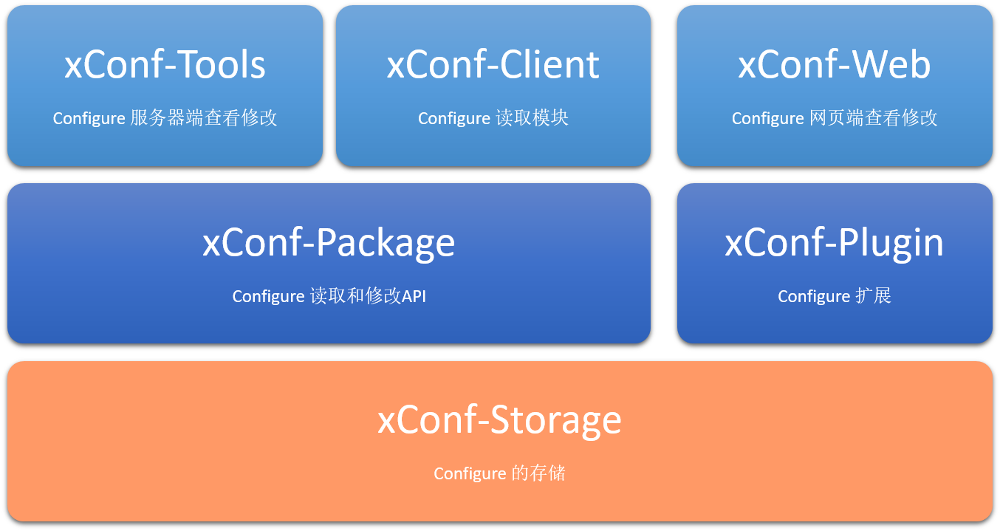

# 详聊IC 配置管理

IC 工程师对配置文件肯定不会陌生，比如 EDA 工具一般有三处优先级不同的配置文件，IC Flow 也都会有一个定义公共信息的配置，今天来详细剖析下我对“配置管理”的理解与思考。有很多开源的配置管理方法与实践，而 IC 行业有区别于一般开发或者软件的，有自己的场景。

工具的命令需要和工具本身的语言契合，比如可以使用 Tcl 直接做配置，而有些项目和设计相关的需要和其他管理软件进行数据交流，Tcl 显得不是那么方便。本文我们一起来讨论下适合IC 场景的配置管理。

从配置的获取方式可以分为，统一配置管理和分布式管理配置，和区块链的概念很像，就是中央管理和去中心化，这个话题各行各业都在讨论，比如svn 和git，各国货币和比特币等。对于IC 的配置管理，很大程度上希望使用统一配置管理，一个项目大家工作在同一个频道下效率会更高，但是每个模块也希望有自己的个性化设置，类似说设计分块，配置需要独立，而且某个模块下好的或者说修正的设置可以共享给整个项目使用，这个又有点分布式的思想。

## 基本的配置需要考虑哪些方面

- 角色配置

角色配置是表达整个组织关系，人员管理，项目中的人员调配。一般这个部分由 Manager 指定谁做什么模块，谁做什么功能，就像演戏一样，导演需要物色合适的人选进行整个角色的分配。

角色很多时候会有不同的系统控制，配置就需要灵活，可导入，可定期更新，或者访问指定的API 直接调用。

- 项目配置

多用于项目的管理和协调，更多得面向各个资源的调配和统一的信息共享，为项目管理提供基础。所有数据都可以多平台访问，方便了不同角色（项目经理，开发经理，开发人员，技术顾问等）的介入。

- 设计配置

具体到开发人员，和具体的设计相关的内容，在多工具环境下，以及数据流转的情况下这个显得特别重要，设计的基础数据做为配置可以在多个步骤之间保持一致。

- 工具配置

配合工具，有些策略性的东西是可以提取出来作为一个标准，有些是完全和具体的工具相关的。这些配置也分为项目公共部分和用户本地部分。

- 专项配置

对于像IP，库等平台，需要专项配置，这些可通过配置的扩展来书写，平台定义了配置的格式以及使用配置的方法，扩展可以更好地适应更多的环境，更方便地进行数据交互。

## xConf 实现与特点

IC System Configure 设计考虑：

- 基本特性：
  - 配置信息简单可读，适合IC 工程师
  - 入口丰富，Web，Server，Tool Shell 都可以进行操作
  - 主从模式，方便统一管理以及本地定制
  - 工具支持丰富，Tcl 做为主力接口
  - 提供API 调度

- 增强特性
  - 握手协议 - 本地配置需要有专门的握手key 来和项目协议进行数据交换
  - 提供更新策略 - 区分大版本和日常小更新，更丰富的更新Rule
  - 无缝集成接口 - 通过内容转换完成无缝接口
  - 专为IC 的Hierarchy 做的配置设计，统一管理
  - 继承和反馈机制，解决数据的同步忧虑
