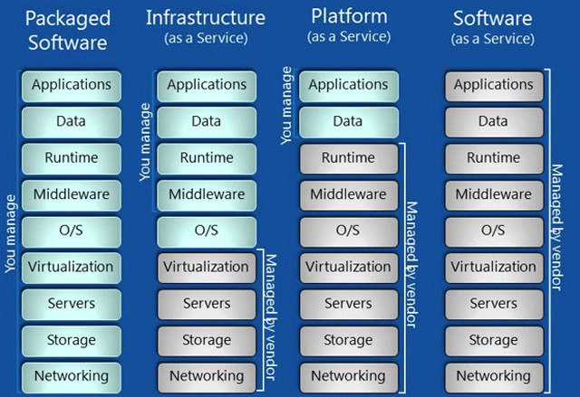

# 漫步云端的EDA

猝不及防，这两天被google 造人的文章刷爆朋友圈，AI 已来，码农们又一次陷入了人活着工作没了的焦虑，ICer 的工作会被EDA 工具替代吗？最近在IC 极客群里面关于“EDA in the Cloud”的话题经过两轮激烈的讨论，群友们贡献了很多新鲜热辣的观点，是时候需要对这个话题进行总结性的归纳了。我因为职业背景的关系，并且之前有参与过相关的国家项目，对这个话题有过长期的关注，所以写这篇文章我也是非常兴奋的。我们并不是云计算的领域专家，只是从IC 工程师的视角来提出一些我们的可能有些外行的观点。以下所述仅作为抛砖引玉，不周之处欢迎批评指正。

## | EDA 上云和谁有关

### IC 设计企业

他们是EDA 厂商重要的客户，其利益诉求是面向市场多快好省的交付芯片，即扩大产能，缩短设计周期，提高良率和可靠性同时节约成本，新的技术浪潮为这一目标提供了可能。有些企业EDA 采购需要满足峰值需求，license 的费用甚至远超过了员工成本，但更多时候license 是处于闲置状态。出于成本的考虑，IC 设计企业对于共享IT/EDA 及周边服务是有潜在需求的。未来的可能性不仅如此，这一点我会在EDA 上云后的服务模式中进一步阐述。

### EDA 厂商

他们的利益诉求是帮助客户实现价值交付，提供更好的计算力，更少的迭代，把工作尽可能多的交给工具去完成。分布式云计算，机器学习等技术为这一目标提供了可能。企业的IC 设计上云平台进一步为机器学习提供了实际项目的样本，促使EDA 工具向类似AlphaGo Zero 的工作模式的转变。共享EDA 的商业模式在流量经济的推动下或许会颠覆旧有的按license 收费的模式。但这个模式下有两个问题，第一，流量用户对于EDA 是否ready，在IC 设计领域是否存在那么大的流量可以催生共享，第二，EDA 工具对于IT 基础设施是否ready，云计算最大的优势在于分布式计算，而很多EDA 工具，譬如ICC, innovus 等并不是基于这种架构写的。在这个前提下，可能优先考虑更适合云计算的工具，FPGA, 仿真工具等，以机器换时间的效果会更明显。

### 工艺厂商和IP 厂商

一方面他们是EDA 厂商非常重要的partner , 另一方面也为IC 设计提供了不可或缺的生产资料即工艺文件，IP数据 等，如果他们联手决定我们的数据出于安全保护不能上传到公有云，也就意味着IC 设计企业的设计数据不能上公有云，可能连共享的私有云都会有很大限制。设计数据能否上云对整个生态影响至关重要，效率，安全，隐私，知识产权等各种因素的考量和博弈或许会推动工艺厂商和IP 厂商的服务模式相应调整，总的来说变化不会那么快。IC 设计企业在使用IP 时，所签署的协议里面IP 数据能否离开企业的私有数据服务器，我个人持比较悲观的态度，短时间内大的IP 厂商和工艺厂商应该不会授权。

## | EDA 上云的服务模式

​IaaS PaaS 还是SaaS?

EDA 上云已经有软件服务的形态了，所以不可能是IaaS，其服务模式应该是PaaS 或SaaS，目前最多能做到PaaS，或介于两者之间。

SaaS 代表了一种未来形态，或许我们终将会走到那里。一个成熟的SaaS 服务有几个明显的标志，第一，订阅式付费而不是license 付费，这对于EDA 现有的商业模式是个非常大的挑战，第二，面向整个行业生态有丰富的接口，譬如工艺厂商，IP 厂商的数据及业务流程对接，第三，非常注重服务，而且服务是很完备的，用户的工作量是非常轻量级的，通用的信息平台及数据，流程构建和管理都应该由SaaS 厂商提供。更进一步，用户做IC 设计的方式，可能只是在交互界面做一些简单的配置，把剩下的工作交给计算机，经过少量的交互和迭代得到一个不错的结果。如果这些条件都不ready，我们只能先勉强称其为PaaS 服务。

一个典型的PaaS 平台可以为用户提供共享 IT/EDA服务，或者流程构建的服务，有条件的PaaS 服务商还可以提供设计服务，再加上与工艺厂商，IP 厂商的数据及业务流程对接，可以极大降低企业成本，并使得企业用户可以把精力专注于设计本身，这种模式首先会在中小企业中受到普遍的欢迎。而中小企业因为数量巨大，一旦形成规模，或许会成为一种新的标准，从而对大企业的模式带来冲击。

## | EDA 和机器学习

无论上云与否，各大EDA 厂商都在加快推进在机器学习领域的布局，这一点在去年的DAC 会议上感触颇深，几乎每一家EDA 厂商都发表了和机器学习有关的演讲和论文。

关于机器学习在EDA 领域的应用，目前处于一个比较尴尬的局面，数据不能上云，EDA 厂商拿不到足够的数据样本来训练机器成为机器学习的一大瓶颈。同时，电路设计未来又与特定应用相关化，所以场景的多样性非常高，要求的多样性也非常高，这些非标准化，需要工程师经验加以tradeoff 的部分也为机器学习增加了新的挑战。总的来说，IC 设计的工作能够完全被计算机取代，目前来看还有很长的路要走。

在芯片领域，IoT 的应用，BAT等互联网巨头的杀入，AI 技术的发展使得市场迅速扩大，从这个角度，市场驱动会倒逼机器学习在EDA 领域的加速落地，届时IC 工程师将会迎来新的职业挑战。

这篇文章内容主要基于IC 极客群聊记录进行二次整理，社群由IC 行业的几位工程师发起，以公益，开源，分享为宗旨，致力于推广IC 极客文化，组织大家深入交流IC 设计领域知识，经验及方法学，打造IC 设计圈的思想国。群内交流的方式为，每周二，五定期推送固定主题的干货文章，发起相关主题的群内头脑风暴和技术分享。也欢迎群友或IC 极客玩家随机发起不固定主题的讨论。下周主题比较轻松，针对ICer 的软技能做一些探讨，包括个人效率，协作效率，届时会随机分享一些实用的XXX。欢迎联系文末的微信号小主入群参与分享交流。

## | 突如其来的广告

本群由IC 行业的几位工程师发起，以公益，开源，分享为宗旨，致力于推广IC 极客文化，组织大家深入交流IC 设计领域知识，经验及方法学，打造IC 设计圈的思想国。群内交流的方式为，每周二，五定期推送固定主题的干货文章，发起相关主题的群内头脑风暴和技术分享。也欢迎群友或IC 极客玩家随机发起不固定主题的讨论。下周比较轻松，针对ICer 的软技能做一些探讨，包括个人效率，协作效率，届时随机分享总结群内的实用技能，如果你身边有对此类话题感兴趣的朋友，不妨邀请他入群一起参与讨论或围观。 如果您希望参与开讲或讨论老样子联系文末的微信号小主。