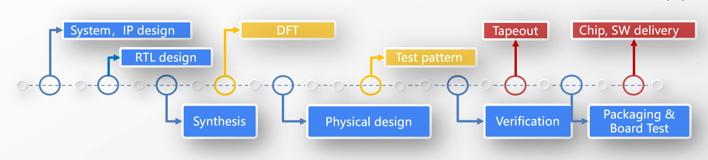

# 说说IC 工程实践中的度量

在IC 设计公司，关于度量在企业内部一直存在一个明显的矛盾。一方面，我们看到管理者们拿出名目繁多的度量方法，试图保障流片的质量和效率，量化员工的工作，把各种量化指标跟员工的KPI 绑定在一起。另一方面，员工们却抱怨不停的报告和各种清单及报表，觉得自己正常的研发工作受到了严重的打扰。但是如果我们想要追求IC 设计效率的极限，必须要克服这个思维陷阱。好的度量方法应该来自一线，服务于一线。在这篇文章中，我们来尝试谈一谈IC 工程实践中的度量。
我服务过的IC 公司，有成熟的大厂也有正在经历从1到多的成长过程中的中小公司。有些公司有非常成熟完备的度量体系，有些正在逐步建立这样的系统。在这个过程中，我看到了这样的系统的必要性以及在中小企业的落地之难，难在大家对度量体系的重视不够，度量多存在于技术委员会的文档里，跟工程师的实际工作脱节，很难落地。希望可以就这些问题给出一些抛砖引玉的思考。

## | 为什么需要度量

度量现在看起来有点像是个泊来物，但早在商鞅变法时期就提出了很多影响深远的度量的理念并积极的应用于实践。现在度量已经越来越发展为工程项目管理中一个成熟的分支。度量的作用体现在：

- 为最终的价值交付建立一套衡量体系，了解目标在哪，我们目前在哪，距离目标有多远，为达成目标持续前进和改善。
- 度量的一个重要意义是统一思想、统一方式，从而使不同的人能够在一致的基准上进行沟通，减少产生误解的可能性。
- 度量需要层级化设计，能够很清楚的指导我们在整个开发环节的哪一层讨论以及讨论的是什么。
- 度量需要有指标体系，帮助工程师理解什么是“done”以及"how good is good"以及帮助技术管理者理解团队效率的潜能及瓶颈，应该往哪个方向提高

## | 如何做

下面这张图是一个典型的SOC 设计流程，也大致对应了很多企业的组织部门，每个环节到下一个环节的交付物是什么，交付标准是什么，做IC 的同学应该都清楚，每个产品和企业有相似也有不同，不在此一一列举。我更多希望从更为通用的工程管理的角度谈一谈度量体系如何构建，即效率，质量，团队能力和可度量基础。
 
### 效率

在上述的流程图中，从立项到time to market 的时间，时间花费由实际任务时间，等待及浪费共同构成。
实际任务时间由以下因素决定

- 计划充分，预期合理
- 任务设定和最终的交付目标直接相关，避免做没有意义的事情
- 有成熟的设计流程，配置管理及自动化程度高
- 前提条件充分，不被中断和打扰

等待由以下原因导致，在实践中需要能够建立系统化的优化策略

- 基于上图，观测及分析前道工序交付到后道工序开始的等待时间
- 工作间有依赖关系，对方因为并行任务太多或经验不足导致交付不及时
- 任务切分或粒度规划不合理，跟工程师经验不匹配
- 管理者指挥调度无节奏，信息传递慢，问题反映上来再有反馈又过了几天

能够识别浪费是消除浪费的前提，浪费主要由以下因素导致，在实践中需要能够建立识别这些浪费并持续改善的机制

- 重复手工劳动
- 准备数据和环境
- 不产生有效价值的活动
- 不良技术实践导致的浪费
- 由于沟通误解，交付质量低，一线人员经验不足等原因导致的返工
- 文档导致的浪费，文档太旧，设计跟文档脱节，流程跟文档脱节，导致其他人阅读文档产出很大误解
- 度量本身导致的浪费
- 任务切换或中断

### 质量

质量体系的建设其核心有两个步骤识别数据的流动，定义完成的标准。质量标准需要能够满足为长期产品线规划架构和设计方法，提高复用，面向团队其他成员易读。此外，还需要
建立一个问题呈现及反馈机制帮助持续改善

- 质量管理需要内化到每一个执行环节
- stage based 检查清单
- 设计流程
- 清楚的定义端到端，什么是“done”以及"how good is good"

当我们谈团队能力时，指的是

- 端到端的交付效率及质量
- 将上述能力在组织内分享及复制的能力
- 评估团队能力时，以下客观因素同样影响交付效率及质量
- design spec 的迭代次数
- 设计，测试，验证的复杂度
- 工具，流程的成熟度及IP 质量

可度量的基础

- 高效的SOC 工程实践基于设计平台和高效的IP 并行设计及复用策略
- 最好有意愿发展产品平台，对于不能批量复用和复制的产品线，需要合理评估度量本身的成本
- 可用的设计流程，清晰的stage 划分，交付物及检查清单定义
- 标准化的变更管理，数据管理及文件管理策略

## | 结语

综上所述，好的度量体系不是管理者设计出来的，是在一线实践出来的。企业一个完整的度量体系组织结构和流水线要覆盖全栈端到端的交付能力。度量的指标体系在可视化业务看板中层次化的体现，将经验模型向度量模型转化。度量的唯一目的是统一目标，持续改善。好的度量体系应该来自一线，像一层皮肤一样附着在一线的工程实践，度量的体系应该是内化成工程实践的日常而不是不在研发工作的基础上增加额外的负担，拒绝度量和实践脱节。

欢迎添加文末我的微信号，一起学习探讨。

## 加入 IC 极客群

本群由IC 行业的几位工程师发起，以公益，开源，分享为宗旨，致力于推广IC 极客文化，组织大家深入交流IC 设计领域知识，经验及方法学，打造IC 设计圈的思想国。群也欢迎群友或IC 极客玩家随机发起不固定主题的讨论。欢迎联系文末的微信号小主入群参与分享交流。

