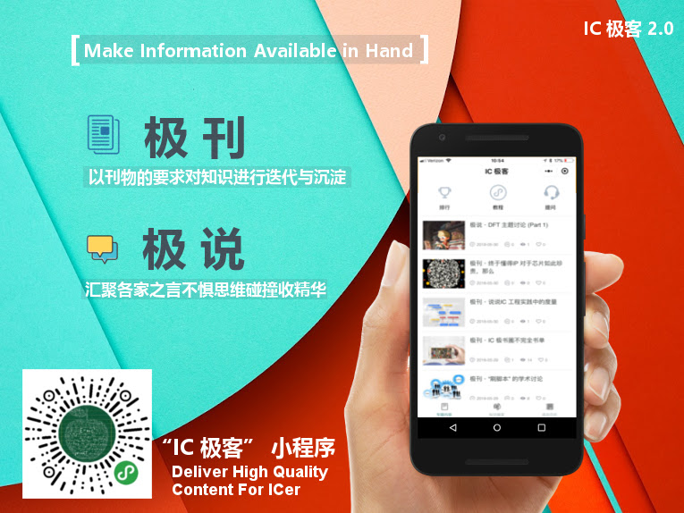

# IC 极客之家 2.0

> 如果您30多岁还在做 IC，技术能做多久，一个 ICer 将如何终老？业余时间如何消磨，知识技能如何提升？我们的工作会被 AI 替代吗，你是否也迷茫？来，听听我的故事，今天是这个故事的第七七四十九天，故事里我的喜悦、迷茫以及成长或许能给您带来一些启发。

西游记里面把七七四十九天作为炼丹的一个周期。IC 极客之家，经过四十九天的淬炼，输出四十九篇文章，我们选择在这个日子发布 **“ IC 极客 2.0 ”**，邀请你来看一看。

## 建 IC 极客之家是一种怎样的体验

上个月，我们建了一个微信群，取名 IC 极客，并且在群公告处写下，以公益、开源、分享为宗旨，致力于推广 IC 极客文化，组织大家深入交流 IC 设计领域知识、经验及方法学，打造 IC 设计圈的思想国。

如果用三个词来总结这七七四十九天，那就是：忙碌、焦虑和惊喜。

能忙到什么程度呢？我们都是用业余时间来做这件事情，一天花在写文章，维护社群的时间最好不要超过 4 个小时，不然其他的事情就会受到影响。后来随着讨论的话题从熟悉到陌生，随着群人数的快速增长，我发现 4 个小时远远不够。特别是关注我们的都是渴求知识和技术交流的 IC 同仁，他们把时间花在这里，并且不断的把我们的社群推荐给周围的同事及好友，这份信任对我们是一份巨大的责任。

为了更好的策划每周的主题讨论，准备提问清单，我每次都会把周围的领域专家地毯式的骚扰一遍，为了确保自己能大致理解讨论的内容，还要捧出几本领域经典图书临时抱佛脚，以及把 google 翻到几十页之后。

而对于我们自己熟悉的领域，就要在讨论中准备大量的发言，甚至一整段完整的演讲。所以，每天晚上如果第二天要讨论的内容还没有准备好，整个人就开始非常焦虑。同样让我焦虑的就是用户增长，因为在非常早期，内容还没有打磨的很好撑不起那么多用户的时候，一方面要避免运营，避免用户的快速增长，一方面又希望增长。包括话题的热度，有时候发起一个话题，无一人回应，只能自己硬着头皮，自问自答，把讨论变成一个演讲。

但是，更多的时候，和群友们每天打成一片，各种嗨聊，认识了很多有趣的朋友也增长了很多见闻。某种程度上，这一个月的所学可能超过了过去一整年的时间。而且这些头像每天都出现在我眼前，感觉像认识了很久的朋友。他们彼此之间提供了很多帮助，对我也一样，交流使我们建立了美好的连接。

## 为什么要建 IC 极客之家

就我而言，我以前在公司里也经常利用零碎时间，譬如午餐会，组织技术委员会的头脑风暴会议，出于自发，没有人要求，我的老大在这件事情上给了我非常非常多支持。更让我欣慰的是，做了几期之后，很多人会主动来找我说，我可不可以加入你们的讨论，我也很有兴趣。

我的工作是 CAD Manager，在做流程构建这件事情上我需要经常去跟大家讨论，去了解用户需求，做思维碰撞以获取灵感。另外，我个人非常喜欢跟大家聊技术，因这些交流而不断的与人建立连接，而与人连接这件事不但感觉非常棒，而且非常有用。很多时候你会发现起决定作用的不再是技术本身。

后来离开职场，希望能用这点手艺继续发挥点作用，于是就把之前线下的模式搬到了线上，有了这个微信群。我们不太敢去做运营，不确定效果，只是希望先小范围打磨一下。但是当用户数完全自发的从最初的十几人增长到今天的近 700 人的两个微信群，完全自发，完全靠用户的口碑传播，没有借助任何运营手段，我慢慢觉得这件事情可能是对的。我们做过一系列的主题，有编程在 IC 中的应用，IP 管理和质量检查，前端，验证，后端，DFT 等等，过程中我们慢慢摸到了门路，越来越清楚 IC 极客之家能够给大家提供什么。

> 对 IC 设计而言，经验比知识重要，交流是获取他人经验的重要手段，我们提供这个交流的平台，并且确保交流中大家的体验和内容质量。我们的发起人问我，这个模式很容易被别人复制怎么破，我说，没关系，这是一门手艺，模式能复制，复制别人的手艺很难，你可以试试。
> 有人说做比说重要，还是要来实战。有些有用的信息，你知道了可以拿去实战，但是大部分时候在你的环境里，这些信息你根本没有渠道获得。很多大厂的技术大拿出来创业去小厂做 CTO，不知道小厂怎么玩，很多经验不知道怎么落地，来我们这里，听听看大家怎么说。
> 我们一方面有一些无聊的时间不知道怎么打发，譬如起床，上下班路上，临睡前，一方面打开手机面对扑面而来的信息不知道该看什么，写公众号的比读公众号的还多，你要看谁的？我们提供的选项是，一方面使得这些无聊的时间变成有趣的交流，一方面群体智慧的输出加上专家确认可以帮助你过滤信息。我们希望可以做到，大家有问题会想到，这件事可以听听极客之家那帮人怎么说。
> 在 2.0 之后，我们会持续的往这个方向努力，持续的打磨我们这份手艺，进一步提升交流的体验，内容的质量。会有更多专家助阵，会有直播，音频和多平台的矩阵。交流过，就算是认识了，日后江湖相见亦是故友重逢。

## 我们的内容服务

> 我们以公益的，开源的，免费的形态提供如下的内容服务
- **极刊**，每周二，五早上七点准时在本公众号更新，专栏作者分享自己的领域经验及方法学
- **极说**，一周主题讨论的内容整理成文，碎片化知识的重新聚合
- **极问**，有人问我你们是不是要做 IC 领域的维基百科，并不是。但是我们希望能够做到，有一类问题，你最先想到的不是去用谷歌搜索而是来极客之家
- 主题讨论，每周二早七点，周三晚10点，周四早七点，准时发起
- 除微信群，小程序，公众号之外，我们也开始试水直播等其他的内容形态

### IC 极客 小程序为内容而生

我们的发起人、技术委员会、新媒体运营志愿者对外都以 IC 极客的标签，负责各自的领域，形成良好的闭环。在过去，我们犯过严重的错误，但不会再犯同样的错。我们希望这个组织可以良性增长。

## 遇见，不负此生

四十九天，是一个小小的轮回，认识了很多新的朋友，得到过很多人的帮助，也收获了很多群友的感谢，这些都坚定了我们持续做下去的信念。开弓没有回头箭，我有一个小目标：
> 与天下的 IC 人，战斗在一线的工程师一道，推广 IC 极客文化，推动 IC 领域知识，经验及方法学的交流和落地。做为一名技术人，一起升级认知，做 IC 的终身学习者和实践者。

高晓松说，行万里路，只为回到内心深处。内心深处，即是吾家。IC 极客之家，是我们IC 人共同的家，除了思想的碰撞，技术的分享，我更希望的是直达内心深处的连接。

今天的这首配乐是我很长时间里的一个单曲循环，On a Slow Boat to China 送给我爱的和爱我的人们，旅途漫长，我们一起抵达。

## 加入 IC 极客 交流群

加 sgsphoto 为好友，入 IC 极客 交流群。

## 支持（Donate）

