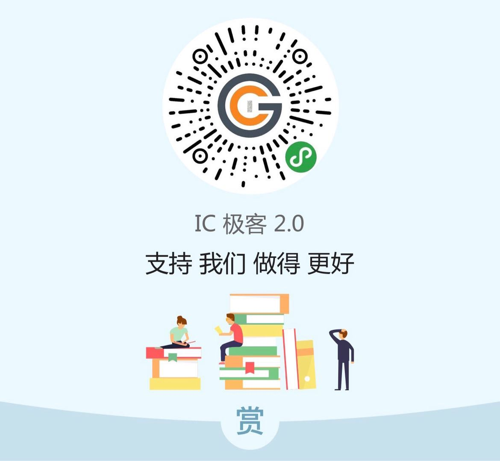

# 后端视角看 IP 交付，质量检查和集成

> 很多 SOC 厂商都依赖 IP 来设计和生产一款 SOC 芯片，做 SOC 的过程其本质就是寻找， 验证和整合 IP 的过程。这个模式在过去几十年已经非常成熟，但是对 IP 的应用模式却随着 市场需求，芯片复杂度，上市时间和成本的压力一直在发生变化，当然这也间接导致了行业内 IP 的生态发生相应的变化，对 IP 交付，质量检查和集成提出了更高的要求。
>
> SOC 芯片流片失败有超过 40% 的原因会和 IP 有关，譬如非常常见的设计本身错误，产品和需求不匹配，版本用错，有些 design for reuse 的 IP，会打包发布，这时候容易出现工艺用错，金属层用错。还有 datasheet 和 IP view 不一致， IP 自身质量不合格或者严格一点说是和 SOC 自身的验证流程不匹配等等。

**本文以后端视角从IP 交付，质量检查和集成三个层面谈一谈他们分别在项目中如何落地**

## IP交付

从 SOC 视角看，对不同来源,不同Vendor 的 IP 的使用分三种情况

- 只为这一个芯片定制的 IP
- IP 的选择来自于 IP 平台，成熟的 hardening IP， design for reuse
- IP 的选择来自于 IP 平台，和 SOC spec 一起规划 IP 开发，design for reuse

对于第一、第三种情况在项目中 IP 需要持续交付，第二种情况大都为一次性交付。在交付过程中需要确认交付清单，版本管理及问题跟踪。通常在企业中会建立一套信息化系统及嵌入设计流程来完成IP 对SOC 的持续交付及集成。

交付检查清单的度量标准通常会从以下几个角度去设计，每家企业会针对各自的情况有所细化和调整，并无统一标准。

- 交付物清单
- 与 SOC 设计流程及所用EDA 工具的匹配度
- IP 的成熟度
- 与 SOC 项目周期的匹配度
- IP 质量检查
- 项目的特殊需求
- 其他

## IP 质量检查

对SOC 设计而言，IP 种类越多，越完整，越成熟，质量越高，越能提升SOC 在质量和time to market 上的竞争力。从用户视角而言，由于市面上或企业内部交付的IP 质量及公信力仍然缺乏统一标准，良莠不齐，从而诞生了从用户视角做IP 质量检查这一需求。

IP 质量检查的度量通常会从如下三个角度去设计，同样，每家企业会针对自己过去遇到的坑去细化落地每一条度量标准。从方法学经验的角度来讲，EDA 公司也给出一些通用的度量标准，直接嵌入工具流程，或者是专用的library quality check 工具，或者是SOC 工具中某些命令和插件。

1. 完整性检查，具体来说包括各个设计环节的交付文档，SOC 设计流程和 EDA 工具所要求的库 的view 是否完整，IP signoff 环境与 SOC signoff 环境是否完整且一致。
2. 不同 view 之间，文档与库之间的 pin 属性，时序, 物理属性的一致性检查。
3. 相同 view 不同库之间的特征属性检查，包括物理属性和时序属性
4. 单个库的特征属性的准确性检查。

这其中两个难点，一是度量标准的确定，二是如何实现。

在实现方法上可以在 EDA 工具现有的library quality check 解决方案的基础上做企业定制化开发和补充。华大和Synopsys 都有相关解决方案，其优势在于，定义标准，完成库信息提取和对比，使用简单，劣势在于在读取第三方工具view 和调用第三方工具以及平台化和高度自动化上存在一定的模糊空间。

整个解决方案中的完整性、平台化、自动化需要靠企业自己的定制化开发做补充。譬如，调用第三方工具和 utility，建立自动化测试平台，自动完成 SOC 调用的所有 IP 的例化，针对 IP 类型属于 IO，数字、模拟，还是混合分别针对其应用场景做定制化检查。

## 集成

IP 面向 SOC 的集成是覆盖整个项目周期的持续集成，在项目不同的阶段应该有不同的标准。从后端视角来看整个持续集成的方案，需要考虑与前端，IP Vendor，IP 部门，Fab 共同确立不同阶段的标准和检查清单。

之所以强调持续集成的概念，一是使得整个集成过程更加高效，自动化和可视化，另一方面，是为了确保让集成在整个项目周期持续的发生，做迭代式的优化以避免流程中的浪费和流片前的 late surprise 。做到这一点在整个流水线构建中基础环境，数据管理，配置管理，流水线 stage 的定义，release 的标准和方法等都需要做统一的考虑。

## 加入 IC 极客群

本群由IC 行业的几位工程师发起，以公益，开源，分享为宗旨，致力于推广 IC 极客文化，组织大家深入交流IC 设计领域知识，经验及方法学，打造 IC 设计圈的思想国。

群也欢迎群友或 IC 极客玩家随机发起不固定主题的讨论。欢迎联系文末的微信号小主入群参与分享交流。

## 支持 （Donate）

