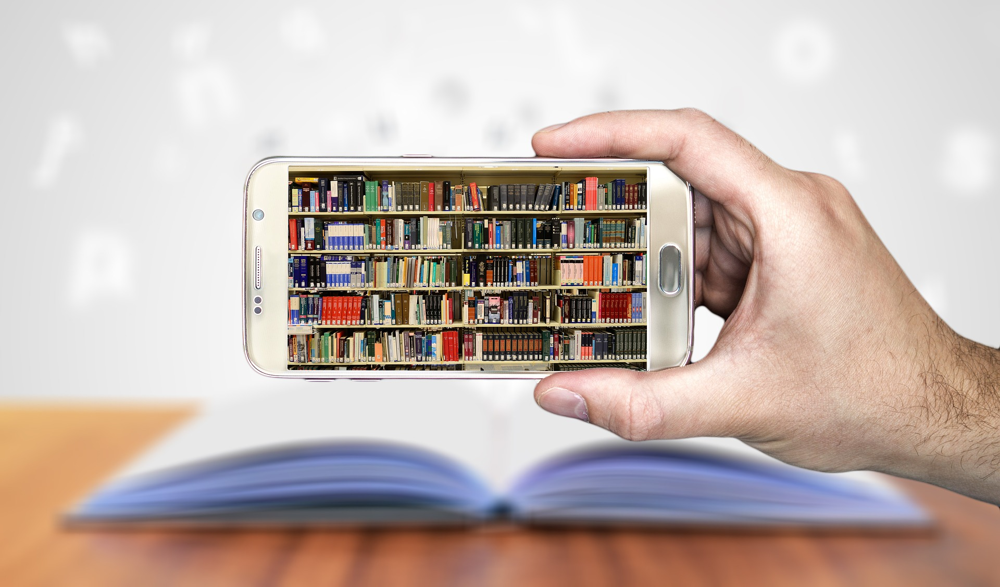

# IC 极客 - 不完全书单

本文经「原本」原创认证，作者Steve Bee，访问yuanben.io查询【[57APZNV1](https://yuanben.io/article/57APZNV13OWTYEU4I5NM89II4FUIJ754DY3LI4LMIYBA374XG2)】获取授权信息。

五一假期 “IC 极客交流群” 中发起了大家对各自领域书籍的推荐，众人拾柴火焰高，总共整理了超过120 本领域书籍。感谢各位极友的推荐。

书单会更新，最好的方法是订阅RSS，或者加入群，或者是GoodReads 上加我为好友。

内容设计到：

- 前端设计（较少）
- 仿真（较少）
- DFT（一些）
- 综合（不少）
- 数字后端（不少）
- 静态时序（一些）
- 流程与CAD（不少）
- 模拟（不少）
- 工艺（一些）
- ...

由于我是从事IC 实现的，所以从综合到时序，后端到CAD 相对多一些。底层系统的还没有，大家有好的读本，材料欢迎继续推荐。

申明：本文并无下载链接，只是一个书单，以及一些工具的介绍。如有问题，可加sgsphoto为好友，进IC 极客交流群讨论。

## 书单

为什么会想到列个书单，首先是4月份的读书日，自然联想到我们的专业书籍也应该有个收集，其次我用豆瓣的体验是，对这些专业书籍，并没有那么多人在看，在评论，而 Goodreads 不同，汇集的人更多样化，像IC 这种小众领域的专业书籍，你可以找到不少评论和相关更详细内容。

也欢迎加我为好友：

Join me in sharing and discovering books on Goodreads.

https://www.goodreads.com/friend/i?invite_token=MjJmNTdjMjUtNDEzMS00OTI4LTgzNjMtNmEzYzIxNzVmZDc2

另外一个值得推荐的工具是Calibre eBook，这个工具是一个本地的图书管理，很容易帮你整理图书，而且更新频率也很高。

自己写文章成书貌似也很流行，可以使用 Gitbook 来进行创作，推荐。

