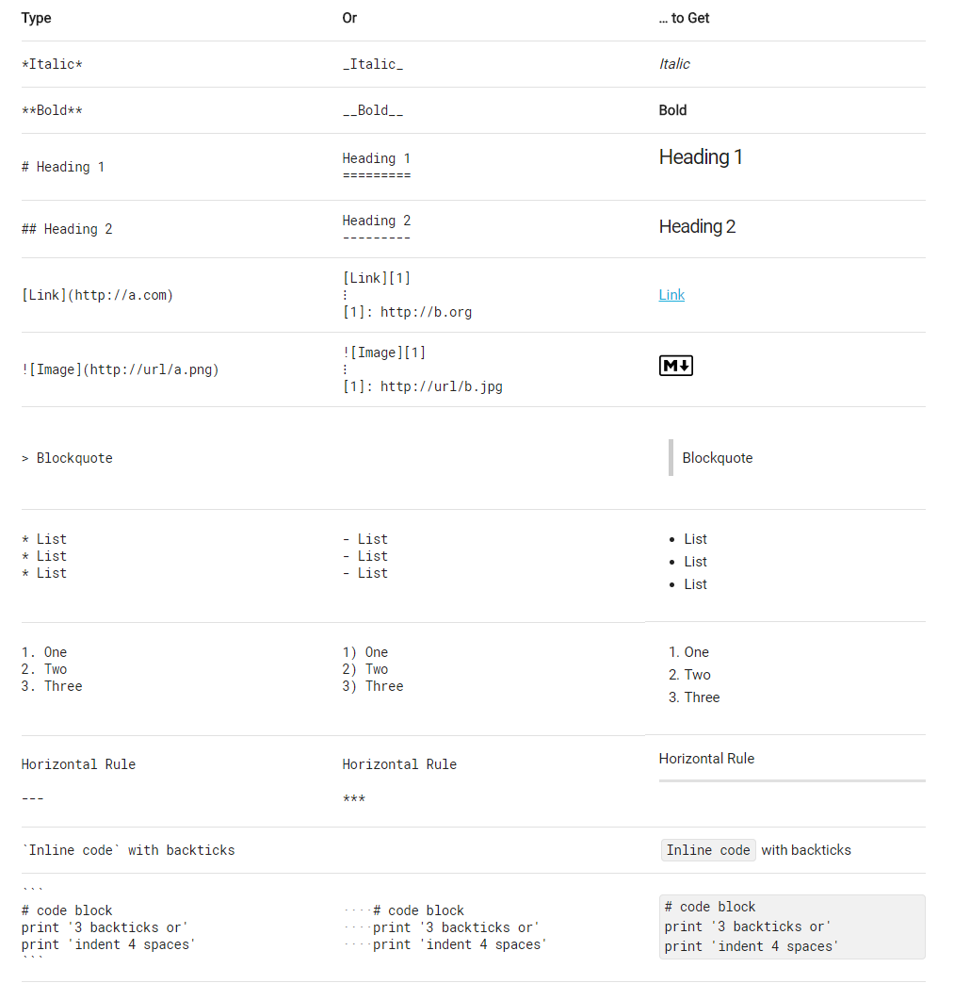

# Markdown Hand booklet

Markdown 是一种轻量级标记语言，创始人为约翰 · 格鲁伯（John Gruber）。它允许我们使用易读易写的纯文本格式编写文档，然后转换成有效的 XHTML（或者 HTML）以及其他格式的文档”。这种语言吸收了很多在电子邮件中已有的纯文本标记的特性。

John Gruber 在 2004 年创造了 Markdown 语言，在语法上有很大一部分是跟亚伦 · 斯沃茨（Aaron Swartz）共同合作的。这个语言的目的是希望大家使用 “易于阅读、易于撰写” 的纯文字格式，并选择性的转换成有效的 XHTML（或是 HTML）。 其中最重要的设计是可读性，也就是说这个语言应该要能直接在字面上的被阅读，而不用被一些格式化指令标记（像是 RTF 与 HTML）。 因此，它是现行电子邮件标记格式的惯例，虽然它也借鉴了很多早期的标记语言，如：Setext、Texile、reStructuredText。 许多网站都使用 Markdown 或是其变种让用户更利于讨论。例如：GitHub、reddit、Diaspora、Stack Exchange、OpenStreetMap 、SourceForge 等。

Markdown 同时还是一个由 Gruber 编写的 Perl 脚本：Markdown.pl。它把用 markdown 语法编写的内容转换成有效的、结构良好的 XHTML 或 HTML 内容，并将左尖括号<和 & 号替换成它们各自的字符实体引用。它可以用作单独的脚本，Blosxom 和 Movable Type 的插件又或者 BBEdit 的文本过滤器.

Markdown 也已经被其他人用 Perl 和别的编程语言重新实现，其中一个 Perl 模块放在了 CPAN(Text::Markdown)上。它基于一个 BSD 风格的许可证分发并可以作为几个内容管理系统的插件。
Markdown 具有一系列衍生版本，用于扩展 Markdown 的功能（如表格、脚注、内嵌 HTML 等等），这些功能原初的 Markdown 尚不具备，它们能让 Markdown 转换成更多的格式，例如 LaTeX，Docbook。Markdown 增强版中比较有名的有 Markdown Extra、MultiMarkdown、 Maruku 等。这些衍生版本要么基于工具，如 Pandoc；要么基于网站，如 GitHub 和 Wikipedia，在语法上基本兼容，但在一些语法和渲染效果上有改动。

## Markdown 基础语法

推荐学习资源：

* 创始人撰写 https://daringfireball.net/projects/markdown/syntax
* 维基百科内容 https://zh.wikipedia.org/wiki/Markdown
* 10 分钟互动教学 http://commonmark.org/help/tutorial/



## Markdown 在 IC 工程师手里可以怎么玩

### 做为常规文档书写

__难度系数 &#9733;&#9733;&#9734;&#9734;&#9734;__

__实用系数 &#9733;&#9733;&#9733;&#9733;&#9733;__

学会基本的语法，并用它取代 Word 等文档编辑器，做为自己内容创作的工具。

* 斜体和粗体
* 分级标题
* 链接 (内、外）
* 图片
* 列表（有序、无序）
* 引用
* 代码块
* 分隔线

有很多工具可以帮助你由简入深地掌握 Markdown。

在线编辑器

* 作业部落 https://www.zybuluo.com/mdeditor
* 简书 http://jianshu.com
* https://dillinger.io/

本地编辑器

Leanote

> 我们都曾是 Evernote 的忠实粉丝, 一直以来 Evernote 都是我们日常知识管理的有效工具。于是我们决定重新创造一款工具，提供 Evernote 所能提供的功能，同时弥补 Evernote 的不足，比如：
>
> * 功能更强的文本编辑器：Evernote 的编辑器不能满足我们的需求, 不能实现文档导航、不能贴代码(格式会乱掉, 作为程序员, 代码是我们的基本需求啊), 图片不能缩放等。
> * Evernote 不支持所有人都喜爱的 markdown 语法，于是我们为 Leanote 配备了一款可以实时渲染的 markdown 编辑器。
> * 如果你是一名开发者，觉得手指怀念 Vim 或 Emacs 了，那么我们还提供给你 Vim 和 Emacs 写作模式，配合 markdown 的格式编辑，写作的时候再也不用去碰鼠标了。
> * 知识积累和知识分享同样重要，因此大家都有自己的笔记账号和社交账号。但为什么这两者不能合二为一呢? Leanote 做到了将二者无缝衔接。
> * 一套完整的、全平台覆盖的软件套装，包括了 web、桌面、安卓、IOS 设备，而且全部开源！
> * 还有...

MarkdownPad

> 用户可以通过键盘快捷键和工具栏按钮来使用或者移除 Markdown 格式。MarkdownPad 左右栏的分割方式令用户可以实时看到 HTML 格式的 Markdown 文档。

Re Text

> ReText 是一个使用 Markdown 语法和 reStructuredText (reST) 结构的文本编辑器，编辑的内容支持导出到 PDF、ODT 和 HTML 以及纯文本，支持即时预览、网页生成以及 HTML 语法高亮、全屏模式，可导出文件到 Google Docs 等。

Mou

> Mou 是 Mac 下杰出的 Markdown 编辑器，提供语法高亮、在线预览、同步滚动、全屏模式，支持自定保存、自动匹配，允许自定义主题，支持 CSS，HTML 和 PDF 导出等。

Markpad
> MarkPad 是款开源的 Markdown 编辑器，与 Window 8 风格和谐友好的界面，可以直接在你的博客或者 GitHub 中打开、保存文档，直接将图片粘贴到 Markdown 文档中。

### 演示报告

__难度系数 &#9733;&#9733;&#9734;&#9734;&#9734;__

__实用系数 &#9733;&#9733;&#9733;&#9733;&#9733;__

如果你要做个简单的演示报告，或者项目汇报，只要对平时写的 Markdown 稍作修改并可以生成演示报告，支持导出 PDF。

Marp

https://github.com/yhatt/marp


## 高级功能

__难度系数 &#9733;&#9733;&#9733;&#9734;&#9734;__

__实用系数 &#9733;&#9733;&#9733;&#9733;&#9733;__

一般的扩展都是使用以下的模块构建的，所以书写语法也必须符合原来的格式。基本上有了这些可以满足 90% 以上的文档需求，而另外的，可以自己定制开发。

* 流程图
  * http://flowchart.js.org
* 序列图 
  * https://bramp.github.io/js-sequence-diagrams/
  * https://mermaidjs.github.io/
* 公式
  * https://www.mathjax.org/
* 思维导图（比较少）
  * https://github.com/dundalek/markmap

## 为 IC 应用扩展功能

__难度系数 &#9733;&#9733;&#9733;&#9734;&#9734;__

__实用系数 &#9733;&#9733;&#9733;&#9733;&#9733;__

Markdown 本身就是一个标记性语言，那么我们可以自己定义一套规则，然后利用脚本进行解析，然后开发自己的 JS 做为扩展，或者直接生成 HTML、PDF。

脑洞一：在Markdown 文档中插入 HTML 的注释，做为某些起始标记，然后读取比如接口表格，那么就可以从 SPEC （当前Markdown 文档）生成Verilog 模块的input 和output，当接口变化时，还可以反向对SPEC 进行更新。

``` html
<!-- HTML Comment-->
```

脑洞二：从后端设计数据库中自动获取某些技术指标，自动填入Markdown 模板，那么Markdown 模板很容易进行数据的展示，比如用于项目会议，或者每周例会。

## 其他 Markdown 话题

__难度系数 &#9733;&#9733;&#9733;&#9733;&#9734;__

__实用系数 &#9747;&#9747;&#9747;&#9747;&#9747;__

* gitbook
* gitpitch
* pandoc
* markdown to html
* perl/tcl/python markdown package
