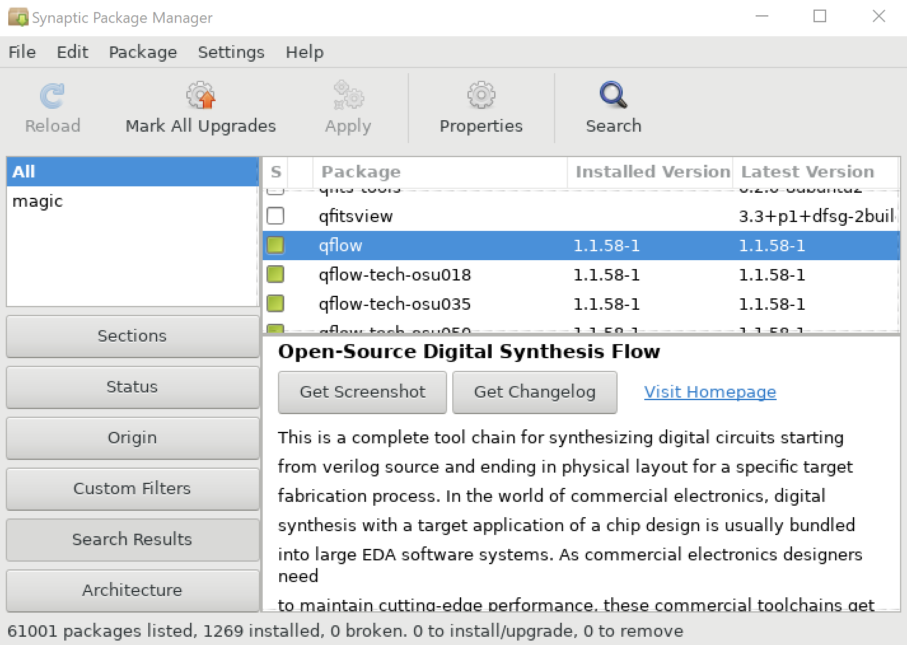

# Tcl/Tk 专题： 商业 EDA 那么好用，要啥开源软件

<div style="width:50%;float:left;border-right-style: dotted;padding-right:5px;font-size:14px;">
问：我就是冲着学 Tcl 来的，你废哩吧唧讲这些没有用的做什么？

答：Tcl 基础知识书上都有，我会通过日常应用场景把书上的内容带出来，这个应该比看书更实用。
</div>
<div style="width:45%;float:right;font-size:14px;">
阅读收获 123：

- 开源协议介绍
- 开源 EDA 安装
- 观点：开源 EDA 存在的价值

</div>

<div style="clear:both;">&nbsp;</div>

---

## 三足鼎立，技术壁垒

在上次的 DAC 上我画了一个三大主流 EDA 公司的成立时间线。从中可以看出没有在一个较长时间一家独大的情况，对于用户来说，有选择的余地。
如果有垄断的情况发生，那么市场的反应自然是不屈服，会催生出新的解决方案。

用户有选择的余地，授权费用在这个行业里也是不透明的，每个企业获得的授权方式基本上没有一个重复。多家 EDA 供应商的存在，技术竞争，服务竞争也在一直地进步。而不会像某些操作系统一样，将用户固定在一个模式下。

从整个半导体设计制作过程来看，由单一个人，单一组织来完成是不可能的，设计简单地分为前端，后端，前端偏向于功能设计和验证，当然包括算法设计，特别是验证，需要硬件的知识，而后端就跟需要和工艺结合。工艺的研发也是单独的艰巨任务，有了工艺，基于 TCAD 的研发再将成果传递到设计工具。这种精密结合的技术流动和研发，需要资本的帮助，资本是逐利的，但是资本可以忍受 5 年，10 年甚至更长期的回报周期。

## 服务对象，行业起伏

EDA 软件的服务对象是硬件设计，那么自然受硬件行业的影响，这个行业的技术积累周期相对长，流片测试，芯片量产，开发周期也比较长。行业相对软件，IT 类的来说还是小众的，单位研发成本就高。密集而长期的投入，自然希望单次效益回收要高。Linux 的社区，开发也是由几大公司在支持着，基本上每个公司你都认识，涵盖了我们的工作生活方方面面。

- https://www.linuxfoundation.org/membership/members/

相当于研发成本被极大的分摊了，这是一种模式，而 Red Hat 除了作为贡献者也是做业务支持的公司。

- DIAMOND SPONSORS
- PLATINUM SPONSORS
- GOLD SPONSORS
- SILVER SPONSORS
- BRONZE SPONSORS
- WOMEN IN OPEN SOURCE LUNCH + BREAKFAST AND BREAKS SPONSOR
- MEDIA SPONSORS

回到 EDA 软件，Fabless 的商业模式出现，让小团队甚至个人在拥有 IP 的情况下就能成立公司，进行产品研发，销售，所以在这么注重 IP，注重知识产权的行业背景下，开源 EDA 成为不了主流。

## 开源阻碍发展

说这句话肯定会被口水淹没，开源是一种精神，情怀，而从商业的角度出发，开源无疑是对个人成果的一个贬低，你的贡献谁都可以用，谁都可以拿去嵌入自己的商业软件（某些开源协议，并非所有）赚钱。

开源当然能调动更多的贡献者，可以就硬件或者工艺来说，开源相当于抹杀发明者的贡献，知识产权保护的是发明者，鼓励创新，Flash，FinFET，以及各种新工艺并不是大部分人有一台 PC 就能参与的，那么申请专利，产学研成果转换是不是一条更好的路呢？

---

虽然我在想为什么开源软件没有得到长足的发展，但还是有很优秀的一些软件，有了它们，研究才能更好的完成，单点突破的小公司也能冒出来，虽然最终避免不了汇入大河或者干涸。

以下部分软件仅列出，我的使用场景较少所以并没有安装尝试，大家可以根据官方安装文档进行安装。

如果是 GNU 下的软件，可以直接在 Synaptic 下看到。

    sudo apt-get install synaptic



### Verilator

- https://www.veripool.org

### ngSpice

Ngspice is a mixed-level/mixed-signal circuit simulator. Its code is based on three open source software packages: Spice3f5, Cider1b1 and Xspice.

- https://github.com/imr/ngspice
- http://ngspice.sourceforge.net/

```shell
sudo apt-get install build-essential
sudo apt-get install automake libtool gperf flex bison
sudo apt-get install libxml2 libxml2-dev
sudo apt-get install libxml-libxml-perl
sudo apt-get install libgd-perl
git clone https://github.com/Qucs/ADMS.git
cd ADMS
sh bootstrap.sh
cd ..
git clone https://github.com/imr/ngspice
cd ngspice
mkdir release debug
./configure --enable-maintainer-mode
sudo make install
```


### eSim

- https://esim.fossee.in/

> eSim (previously known as Oscad / FreeEDA) is an open source EDA tool for circuit design, simulation, analysis and PCB design. It is an integrated tool built using open source software such as KiCad (http://www.kicad-pcb.org) and Ngspice (http://ngspice.sourceforge.net/). eSim is released under GPL.
>
> eSim offers similar capabilities and ease of use as any equivalent proprietary software for schematic creation, simulation and PCB design, without having to pay a huge amount of money to procure licenses. Hence it can be an affordable alternative to educational institutions and SMEs. It can serve as an alternative to commercially available/ licensed software tools like OrCAD, Xpedition and HSPICE.
>
> Features of eSim
> - Draw circuits using KiCad, create a netlist and simulate using Ngspice.
> - Do PCB design and generate Gerber files using KiCad.
> - Add/Edit device models and subcircuits using the Model Builder and Subcircuit Builder tools.
> - Runs on Ubuntu Linux and Windows.

```shell
wget https://github.com/FOSSEE/eSim/archive/develop.zip
unzip develop.zip
cd eSim-develop
sudo ./install-linux.sh --install
esim
```


### Netgen

- http://opencircuitdesign.com/netgen/

> Netgen is a tool for comparing netlists, a process known as LVS, which stands for "Layout vs. Schematic". This is an important step in the integrated circuit design flow, ensuring that the geometry that has been laid out matches the expected circuit. Very small circuits can bypass this step by confirming circuit operation through extraction and simulation. Very large digital circuits are usually generated by tools from high-level descriptions, using compilers that ensure the correct layout geometry. The greatest need for LVS is in large analog or mixed-signal circuits that cannot be simulated in reasonable time. Even for small circuits, LVS can be done much faster than simulation, and provides feedback that makes it easier to find an error than does a simulation.

可在 Synaptic Package Mangement 中找到。

### Alliance

> Alliance VLSI CAD System is free software is a complete set of free CAD tools and portable libraries for VLSI design. It includes a VHDL compiler and simulator, logic synthesis tools, and automatic place and route tools. A complete set of portable CMOS libraries is provided. Alliance is the result of a twelve year effort spent at ASIM department of LIP6 laboratory of the Pierre et Marie Curie University (Paris VI, France). Alliance has been used for research projects such as the 875 000 transistors StaCS superscalar microprocessor and 400 000 transistors IEEE Gigabit HSL Router.

http://www-asim.lip6.fr/recherche/alliance/

可在 Synaptic Package Mangement 可以找到。

安装可参考：

- https://www-soc.lip6.fr/equipe-cian/logiciels/alliance/

### yosys

- http://www.clifford.at/yosys/

> Yosys is a framework for Verilog RTL synthesis. It currently has extensive Verilog-2005 support and provides a basic set of synthesis algorithms for various application domains. Selected features and typical applications:
>
> - Process almost any synthesizable Verilog-2005 design
> - Converting Verilog to BLIF / EDIF/ BTOR / SMT-LIB / simple RTL Verilog / etc.
> - Built-in formal methods for checking properties and equivalence
> - Mapping to ASIC standard cell libraries (in Liberty File Format)
> - Mapping to Xilinx 7-Series and Lattice iCE40 FPGAs
> - Foundation and/or front-end for custom flows
>
>Yosys can be adapted to perform any synthesis job by > combining the existing passes (algorithms) using synthesis scripts and adding additional passes as needed by extending the Yosys C++ code base.
>
> Yosys is free software licensed under the ISC license (a GPL compatible license that is similar in terms to the MIT license or the 2-clause BSD license).

```shell
sudo add-apt-repository ppa:saltmakrell/ppa
sudo apt-get update
sudo apt-get install yosys
```


### openTimer

- https://web.engr.illinois.edu/~thuang19/software/timer/OpenTimer.html

> OpenTimer is a high-performance academic timing analysis tool developed by Tsung-Wei Huang and Prof. Martin D. F. Wong in the University of Illinois at Urbana-Champaign (UIUC), IL, USA. Evolving from its previous generation "UI-Timer", OpenTimer works on industry formats (.v, .spef, .lib, .sdc, .lef, .def), and supports important features such as block-based analysis, path-based analysis, cppr, incremental timing, and multi-threading. OpenTimer is extremely fast by its effective data structure and algorithm which can efficiently and accurately analyze large-scale designs. To further facilitate seamless integration between timing and other electronic design automation (EDA) applications such as timing-driven placement and routing, OpenTimer provides user-friendly application programming inteface (API) for interactive analysis. Most importantly, OpenTimer is open-source!

```shell
wget https://web.engr.illinois.edu/~thuang19/software/timer/OpenTimer-1.0.6.tar.gz
./configure
make
make install
OpenTimer
```


### qflow / graywolf / qrouter / MAGIC

- http://opencircuitdesign.com/qflow/
- https://github.com/rubund/graywolf
- http://opencircuitdesign.com/qrouter
- http://opencircuitdesign.com/magic/

> This is a complete tool chain for synthesizing digital circuits starting from verilog source and ending in physical layout for a specific target fabrication process. In the world of commercial electronics, digital synthesis with a target application of a chip design is usually bundled into large EDA software systems. As commercial electronics designers need to maintain cutting-edge performance, these commercial toolchains get more and more expensive, and have largely priced themselves out of all but the established integrated circuit manufacturers. This leaves an unfortunate gap where startup companies and small businesses cannot afford to do any sort of integrated circuit design.
>
> Qflow tries to fill this gap.

由于本身已经在 Syntantic 包管理器中，安装起来比较顺利的。

```shell
sudo apt-get install qflow
sudo apt-get install graywolf
sudo apt-get install qrouter
```

