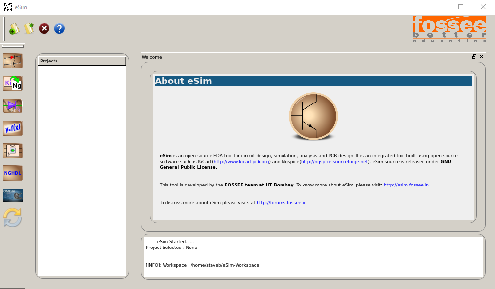

# Tcl/Tk 专题： 商业EDA那么好用，要啥开源软件

问：我就是冲着学 Tcl 来的，你废哩吧唧讲这些没有用的做什么？

答：Tcl 基础知识书上都有，我会通过日常应用场景把书上的内容带出来，这个应该比看书更实用。

阅读收获 123：

- 开源协议介绍
- 开源 EDA 安装
- 观点：开源 EDA 存在的价值

&nbsp;

---

Verilator
https://www.veripool.org

MAGIC
http://opencircuitdesign.com/magic/

ngSpice
Ngspice is a mixed-level/mixed-signal circuit simulator. Its code is based on three open source software packages: Spice3f5, Cider1b1 and Xspice.

https://github.com/imr/ngspice
http://ngspice.sourceforge.net/

eSim
https://esim.fossee.in/
Netgen is a tool for comparing netlists, a process known as LVS, which stands for "Layout vs. Schematic". This is an important step in the integrated circuit design flow, ensuring that the geometry that has been laid out matches the expected circuit. Very small circuits can bypass this step by confirming circuit operation through extraction and simulation. Very large digital circuits are usually generated by tools from high-level descriptions, using compilers that ensure the correct layout geometry. The greatest need for LVS is in large analog or mixed-signal circuits that cannot be simulated in reasonable time. Even for small circuits, LVS can be done much faster than simulation, and provides feedback that makes it easier to find an error than does a simulation.
Netgen
http://opencircuitdesign.com/netgen/

Alliance VLSI CAD System is free software
Alliance is a complete set of free CAD tools and portable libraries for VLSI design. It includes a VHDL compiler and simulator, logic synthesis tools, and automatic place and route tools. A complete set of portable CMOS libraries is provided. Alliance is the result of a twelve year effort spent at ASIM department of LIP6 laboratory of the Pierre et Marie Curie University (Paris VI, France). Alliance has been used for research projects such as the 875 000 transistors StaCS superscalar microprocessor and 400 000 transistors IEEE Gigabit HSL Router.

http://www-asim.lip6.fr/recherche/alliance/

yosys
http://www.clifford.at/yosys/

openTimer
https://web.engr.illinois.edu/~thuang19/software/timer/OpenTimer.html

qflow
http://opencircuitdesign.com/qflow/

graywolf

qrouter

