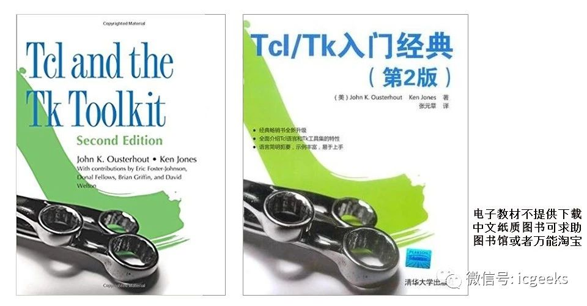

# 一天学懂 Tcl 思想

Tcl 小课堂今天来点实在的，怎么在一篇文章里教会你用 Tcl，有经验的 Tcler 也可以看看，或许可以燃起对 Tcl 更多的兴趣。觉得写得好的，打赏点赞转发，觉得写得一般或者不好的，私下里和我提提意见就可以了。

一天学会 Tcl 并不是一天掌握 Tcl，你写简历的时候可能会用到下面的几个英文单词，那么我觉得这篇文章只能帮你达到 Know 的层次，也就是最基础的 “会” 的阶段，达到入门，小课堂只能做为兴趣小组，关键课后要下功夫，大家有好的读书学习笔记、学习笔记也可以发给我，然后分享给大家，发挥兴趣小组的最大力量。

* Know
* Familiar
* Master
* Experienced
* Strong Experienced

## Tcl 学习教材



* 英文名：Tcl and the Tk Toolkit (2nd Edition)
* 中文名：Tcl/Tk入门经典（第2版）
* 作者：John K. Ousterhout, Ken Jones
* 英文版出版社：Addison-Wesley Professional
* 中文版出版社：清华大学出版社
* 出版时间：2009年9月12日
* 页数：816页
* Goodreads：
  * https://www.goodreads.com/book/show/6362662-tcl-and-the-tk-toolkit
* 亚马逊：
  * https://www.amazon.cn/dp/032133633X/
* 教材支持版本：Tcl 8.5

## Tcl 介绍

Tcl 的介绍，请看我之前写的一篇三十而立的Tcl，这里不赘述了，点击原文或者也可在小程序中找到。

* https://qfshare.com/ic-%E4%B8%BA%E4%BD%95%E5%81%8F%E6%81%8B%E4%B8%89%E5%8D%81%E8%80%8C%E7%AB%8B%E7%9A%84tcl/

要立即开始编写 Tcl 脚本，你的 Linux 和 Mac 可以即刻开始，而 Windows 可搜索 ActiveTcl 进行一路 Next 的安装。

## 为什么学习 Tcl

“使用 Tcl” 是学习 Tcl 的第一动力，数字 IC 设计工程师使用的工具无论前端还是后端，应该大部分是支持 Tcl 做为交互语言的；而模拟 IC 工程师可能少一点，但也能找到那么一两个支持 Tcl 的。

如果你压根用不到 Tcl，或者可预见的未来也不会和 Tcl 打交道，我觉得没有学习的必要。当然如果你想了解下我怎么讲一天学习 Tcl 也是可以继续看下去的。

## Tcl 怎样一天就上手

如果你有一定的编程基础，那么学习一门新语言并不难，熟练使用语言去解决问题才是工作中的常态，这也回到了学习 Tcl 的动力所在。

想一想，如果想要设计一门语言，你会怎么做，我们这里只谈 Interpreted Lanuage（关于 Compiled Lanuage 和 Interpreted Lanuage 的区别，是常见的一个讨论，可搜索之）。最直观的就是一个 Compiled Lanuage 需要编译后执行， Interpreted Lanuage 可以直接执行看结果。涉及到编译器和解释器的区别，花1分钟理解下：

**编译器**

一种计算机程序，负责把一种编程语言编写的源码转换成另外一种计算机代码，后者往往是以二进制的形式被称为目标代码(object code)。这个转换的过程通常的目的是生成可执行的程序。

**解释器**

一种计算机程序，它直接执行由编程语言或脚本语言编写的代码，并不会把源代码预编译成机器码。一个解释器，通常会用以下的姿势来执行程序代码：分析源代码，并且直接执行；把源代码翻译成相对更加高效率的中间码，然后立即执行它；执行由解释器内部的编译器预编译后保存的代码。

所以 Tcl 的 Interp 是一个解释器，就像一个黑盒子，输入 Tcl 语法规则的命令，经过这个黑盒子立即返回结果。所以我们学习 Tcl 语法就是要掌握 Tcl 语法设计的特点，应用扩展的能力，后续如果还有兴趣可以深入编译原理，或者 Tcl 本身的设计思想。

说了这么多，只是想让说明白，首先要学的是解释器对外部输入命令的 “词法分析”，也就是一条命令输入到解释器里后，Tcl 解释器是如何去拆解它的，Tcl 的最终执行语言是 C，就像上面提到的，Tcl 将你的输入意图通过一个黑盒子转换成 C 来执行。

Tcl 词法分析包含了一些基础部件和一些规则。Tcl 是基于字符串构建的，其基本单位是 Word，word 构成了 Tcl 的命令和选项。规则中最重要的概念是替换。大家先有个概念，稍后举例说明。

为了举例方便，我们先学两个最简单的命令，set 和 puts，使用 set 对一个变量进行赋值（很多语言中直接 = 就是赋值），而 puts 可以将命令输出到文件，或者屏幕上（类似于 shell 的 echo，或者其他语言的 print）。

```tcl
set a 13 ;
puts $a ;
```

### 命令

Tcl 命令使用行或者分号来隔开命令，我一般习惯新起一行也会加分号，避免一些不同平台可能带来的回车问题，也是其他语言带过来的习惯。

单条 Tcl 命令的格式为：command arg1 arg2 arg3 …，Tcl 解释器相当于读了一个句子，并分析找到对应需要执行的功能，并返回结果。Tcl 并不区分数字和字符，Tcl 将整条命令当成一个字符串并根据空白字符拆分为子串进行解析，就是说 Tcl 对变量的类型并不关心，如果你不给对相应的类型，Error Out 或者返回不可预测的结果。

### 替换

当一个命令字符串很复杂的时候，比如命令套命令，还有变量，还有特殊字符，Tcl 解释器的处理方式就是由内而外替换，我所谓的内外指的是命令外层和内层，用下面这个命令来理解三个主要的替换类型：

* 命令替换
* 变量替换
* 转义替换

``` tcl
set a 13 ;
puts "[set a [expr $a + 3]] \n"
```

第二个命令最终输出的结果是 ”16 “，然后回车换行，此时的变量 a 的值是16。我们来分析下如何由内而外：

整个命令最外层是要输出一个字符串，内部字符串并非一个简单的字符串，而是有命令和变量等组成，执行内部替换，set 是一个命令，而 \n 是一个换行符。我们从内而外来手动执行这个命令：

### 注释

```tcl
expr $a + 3 ; # 得到 16
set a 6 ; # 把 16 赋值给 a# 将 \n 转义为换行，得到一个字符串 “16 换行"，
puts "16 \n" ; # 换行在不同平台对应的应该是一个二进制机器码
```

从上面的例子可以看出我使用了两种注释方法，在分号后以 # 开始，或者新的一行以 # 开始。归根到底是一个，在命令分隔符的第一个非空字符是 # 的时候，解析为注释。

### 空格或者其他空白字符

这个是用来对 Tcl word 的分隔符，也用于分隔 Tcl 中的一个数据类型 List。

```tcl
set age       29
set name      Jack
set position  Engineer
```

### 变量的赋值与使用

变量使用的时候形式为 $varname 加 变量名字。

赋值的时候，使用 set varname value。

### 括号，引号的意义

大括号（Braces），在大括号内的信息不能被替换，相当于一个隔离墙，如果需要替换可以使用引号（double quote）。

方括号（Square brackets），创建嵌套的命令，既然是嵌套就是在内部，按照替换原则，越内部的先被替换掉。

双引号（double quote），将一串字符并成一个单一的 word，就是让 Tcl 解释器明白即使引号内部有很多空格，也是作为一个 word 来处理。

小括号（Round brackets），当这个出现在变量中，做为数组 index 的 container，比如 set mine(name) Steve，name 就是数组的一个 index。

### 基本编程技能

下面针对每个子主题举简单的例子，不多写文字了。

* 变量定义与使用

```tcl
set tmp1 "Hello" ;
set tmp2 "ICGeek" ;
puts "$tmp1 $tmp2" ;
```

* 变量可动态创建

```tcl
set tmp_varname "xyz" ;
set $tmp_varname "Hello ICGeek" ;
set $tmp_varname ;
eval puts $$tmp_varname ;
```

* 列表

```tcl
set tmp_list "1 2 3 4 5" ;
set tmp_index 4 ;
puts [lindex $tmp_list [expr $tmp_index - 1]]
```

* 数组

```tcl
set person(name) Jack ;
set person(age) 29 ;
set person(position) engineer ;
set person(123) xyz ;
puts [array names person]
```

* 字典

```tcl
dict set mydict a {b c} ;
dict get $mydict a b
```

* 字符串处理

```tcl
set tmpstr "123456789abcdef" ;
string index $tmpstr 9 ;
string first "34" $tmpstr ;
string trimright $tmpstr "def"
```

* 正则表达式

```tcl
set pattern "abc(123)\{0,1\}def" ;
set tmpstr "my string is abcdef" ;
set is_match [regexp $pattern $tmpstr matchall match_first] ;
puts $matchallputs $match_first
```

* 输入输出

```tcl
set myfile "./tmp.txt" ;
set filehandle_myfile [open $myfile a] ;
puts $filehandle_myfile "# This is my file" ;
flush $filehandle_myfileclose $filehandle_myfile
```

* 条件语句

```tcl
set is_new false ;
if {$is_new} {
  puts "You are new"
} else {
  puts "You are not new"
}
```

* 循环语句

```tcl
for {set cnt 0} {$cnt < 10} {incr cnt} {
  puts "Counter: $cnt" ;
  sleep 1 ;
}
```

* 自定义函数或者过程

```tcl
proc myfirstproc {args} {
  puts "This is my first proc" ;
  puts "My args are \"$args\"" ;
  puts [info level 0] ;
}
myfirstproc a b c d;
```

* 错误调试

```tcl
set myvar [error "my error message"] ;
puts $errorInfo
```

* 作用域

```tcl
set global_var "xyz" ;
proc p1 {{x 1}} {
  puts [lindex $x 0] ; # default value
  if {[catch {puts $global_var} errmsg]} {
    puts $errmsg ;
  }
  global global_var ;
  if {[catch {puts $global_var} errmsg]} {
    puts $errmsg ;
  }
}
p1
```