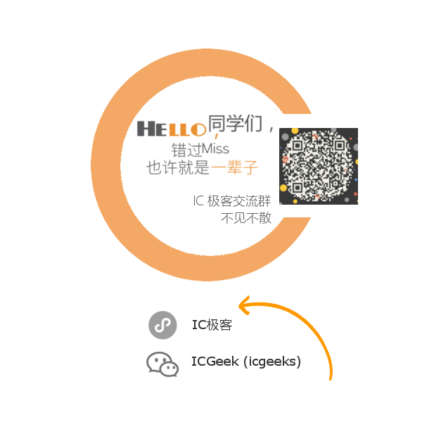
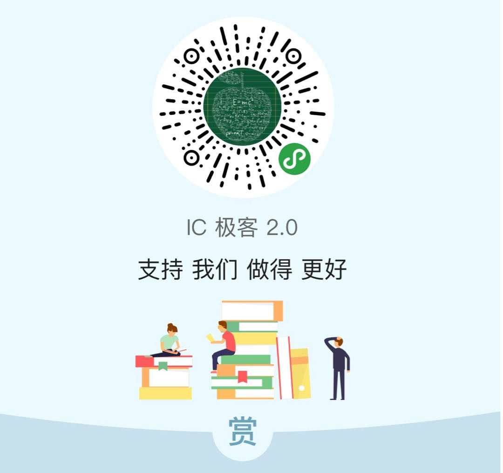

# 极刊・Tcl 学习工作环境搭建 Zsh Tmux Vim 三剑客

Steve 陪你读 IC：

- 用我的文字帮你把书读薄
- 用我的经验帮你把书读厚

## 往期链接

0. Tcl/Tk From Novice to Expert
1. 语言选择之路 & Tcl 在工作中的占比

---

## Ubuntu in Win10

我的环境是基于Win10 Ubuntu 的，GUI 方案使用 Ximg。

### 查看安装要求和设置准备

并不是所有 Win10 都能装Linux Subsystem 的，访问Windows Store 就会帮你自动检测你是不是符合安装要求。

Win 系统版本必须是 14393 以上，系统类型必须是 64 位操作系统。

开启开发人员模式

- 点击左下角开始 > 设置 > 更新和安全 > 针对开发人员
- 勾选开发人员模式，点击

开启适用于 Linux 的 Windows 子系统

- 点击左下角开始 > 搜索 “启用或关闭 Windows 功能”
- 勾选 适用于 Linux 的 Windows 子系统(beta) ，点击确定

### 安装Ubuntu

进入商店搜 Ubuntu 或者 Linux 直接安装。

### 安装 Ximg

对于Linux 的图形来说，需要一个Display 来作为GUI 的显示。

安装Ximg 并启动。

在Ubuntu 中设置DISPLAY 环境变量为":0.0"。

## 安装 Zsh Tmux Vim 和相关插件

## 加入 IC 极客群

本群由IC 行业的几位工程师发起，以公益，开源，分享为宗旨，致力于推广 IC 极客文化，组织大家深入交流IC 设计领域知识，经验及方法学，打造 IC 设计圈的思想国。

群也欢迎群友或 IC 极客玩家随机发起不固定主题的讨论。欢迎联系文末的微信号小主入群参与分享交流。

## 支持 （Donate）

