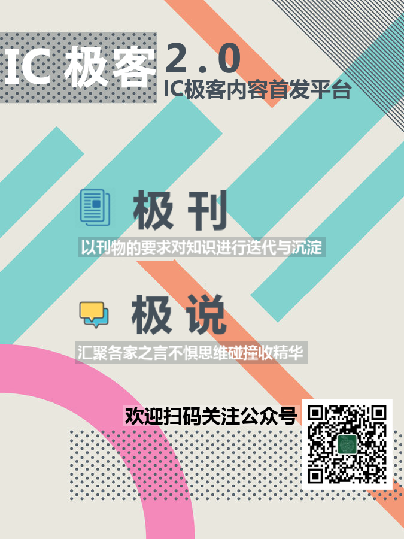

# 极说・面试及职场十问

作者：IC 极客交流群

## 关于我们 ：

> 1. IC 极客之家由IC 行业的几位工程师发起，以公益，开源，分享为宗旨，致力于推广IC 极客文化，组织大家深入交流IC 设计领域知识，经验及方法学，打造IC 设计圈的思想国。
> 2. 极刊，极说，极问文章请关注公众号icgeeks. 极刊为独立撰稿人关于IC 设计的技术分享，极说与极问基于讨论交流信息整理，内容由技术委员会确认发布。
> 3. 欢迎文末留言参与讨论，入群，群内服务及合作请联系微信号sgsphoto

面试如何拿到心仪的offer？职业选择向左右还是向右走？是否存在一条职业进阶的通道？这是每一个职场人迷茫时的向天三问。IC 极客的工程师与你相互陪伴，共同成长，点开音乐，听他们与你聊一聊掏心窝子的话。

---

## &#9758; 当面试官问，你对加班怎么看，你会怎么回答？

观点一： 问到加班，潜台词是能否承受加班。答：可以适度，就看项目需要，但是一直加肯定也不行，你心里怎么想的就照实说比较好。

观点二： 分情况，对于公司紧急且重要的项目，加班当然是义不容辞的；如果所做的事情的mission 太具有吸引力了，会愿意为了那个吸引力加班；如果是管理或流程上的问题导致的加班，会忍不住去做优化；如果这几类case 都不是，原则上反对加班。

## &#9758; 哪些细节能暴露面试者只是在讲故事而不是真的有深入的经验和理解，举个例子。

观点一： 一般面试针对简历中所列技能，应聘者简历所列几乎无所不能，但往往问一些最基本的问题就原形毕露。参与的面试，我很喜欢用白板，譬如让应聘者写一段简单的关于fsm的代码，看看coding习惯如何，能暴露很多细节。

观点二： 需要区分是他做的项目或产品本身有难度有挑战还是他自己在其中独立承担了有挑战的事情。特别是流程和文档都非常完备的大厂，有时候他只是在描述公司的流程和怎么做项目是这样的状况，但是会给面试官一种错觉，这些事情是他做的。对我而言一个比较好用的做法是，针对对方对自己职业技能的描述，直接抛出一个虚拟项目或复杂任务，请他完整的描述如何实现。

观点三： 面试是为了选人不是为了难为人，做题目写代码的面试，每个人都有其专长，也许你认为简单的，候选人正好不知道也有可能，通过对过往项目的描述，深入的问，可以了解其技术掌握和交流方式是否得当。

## &#9758; 面试中通常会被问到，请介绍一个你做过的最复杂的项目，你会怎么回答？
 
观点一： 选一个成功完成的复杂项目，讲清楚三个点，1- 该项目的业务价值，2- 自己在其中承担的角色和跟别人的协作关系，3- 描述实现过程中的重点和难点以及解决方案

## &#9758; 面试中通常会被问到，请分享一个你经历过的失败，你会怎么回答？

观点一： 我第一次面试问到失败的经历，傻傻按照网路上的模板，希望突出自己怎么解决，收到什么启发，现在想想如果被问到，我会答我确实失败了。没做过和做过几个问题就被问出来了。 

观点二： 成功，失败案例都不重要。关键是过程中的细节，体现真的是在用心思考，尝试

## &#9758; 就业选择去大厂还是小厂？主要考虑哪些因素？

观点一：大公司都这样的，进去就会往一个螺丝钉的方向发展，规范化流程倒是真的，但是有个时间期限，你大概两三年时间就能理解到其中的精髓了，待的更久人就会有废掉的倾向。有用的资料很多，真有人空余时间抱着有价值的资料细心阅读吗？恐怕很少有人这么勤奋且有远见。

观点二：给自己一个目标，做有门槛有竞争力的工作，不要让自己的工作很容易被替代。保持学习，持续提高自己的技能，多出去面试，看看市场上需要什么。

观点三：后端我觉得更多会流入foundry和design service，术业有专攻，当然大厂还是养得起后端team的。创业公司，小公司，主打功能和应用，后端是服务型部门，对这些公司来说没有必要，eda 公司，foundry都有自己的design service，自己养不划算。当公司流片项目可以全年转起来的时候，那已经大到一定程度了。去大厂还是小厂，去什么岗位还是要做些了解的，不是完全可以套用网上的语录。

## &#9758; IC 设计是一个高度流程化的工种，如何平衡公司的发展和个人发展之间的冲突

观点一：现在进大公司，你接触不到整个Front-End design flow, 或者说概率很小，就相当于把你局限在一个很小的范围内了，至于未来职业发展，当然有牛人可以一步一步向上。

观点二：这并不是公司的问题，因为公司的制度就是要把任务流程化，越细越好，这样即使谁离职，也能把影响降到最低。employee想学的多，但manager就是想把流程细分，不同的出发点。

观点三：公司制度是制度，个人发展和培养，公司就可以不负责了么？
如果一个员工希望学到更多接触更多，公司还不允许，那就是公司的事了。虽然 这两点有些冲突，但并非不可调和。

观点四：公司不是学校， All is business. 要想清楚, 公司付钱给你, 可以拿到什么回报。 从这个角度去做事。从公司, 从项目组的角度出发, 给公司, 给项目组可以带来的贡献和利益 

## &#9758; 有哪些不好的职场文化会扼杀员工的幸福感？

观点一：人肉干，体力活，重复性劳动。
工作的乐趣在于创造性但任何项目里都少不了脏活苦活，理想状态是：有挑战有意思的创造性工作和脏活苦活比例大致相等。怕的是后者的比例太大，每天干到力竭却感受不到自己的成长，更看不到现实跟职业理想之间的通路。

观点二：不能专注于设计本身，杂事太多
譬如完成一项工作所需要的信息量不够，没有足够的文档，人肉收集和搬运各种需要的数据和信息。譬如每天开大量的会，做大量的沟通，为了解决一个问题，有时候要花上两周的时间发邮件、找关键人物、组织会议、跟不同的人解释五遍以上的上下文。

观点三：加班熬夜赶死线。对IC 工程师而言，加班是常态，流片期间更是恨不得一周干8天每天25小时。但很多加班背后的原因却吸引了深深的伤害和仇恨。伤害之一，schedule 定的不合理，计划定的太粗犷；伤害之二，我本人的工作完成的很好，但被迫为猪队友填坑；伤害之三，加班但没产出什么价值。

## &#9758; 职场的升级打怪之路，分享一下你的经验和思考

观点一：先强大自己的知识面和信息量。建议去 linkedin上看看，那些高层都是什么样的晋升路线。然后基于海量高管的简历做个大数据分析，就可以分析出有些岗容易出VP 和CEO，有些岗做到总监就封顶了。

观点二：know something about everything,
know everything about something. 翻译成中文的版本就是要做T型，横要宽，竖要长 是先横后竖，还是反过来，最终是一样的，
具体问题具体分析。另外不同公司要求的技术深度是不一样的。design house，service，foundry，对深度的理解是差距很大的。

观点三：对于T型能力培养，大公司因为分工明确可以培养竖长，小公司可以涉猎更多工作可以培养横宽。所以要给自己现阶段的工作定好位，最好规划，否则就一条腿长一条腿短了

观点四：我觉得应先竖再横，竖两三年就开始横，这样路会比较宽 要信息量，也要有相关的技术背景才行，这样才能作筛选和判断，这就是横。踏踏实实做好每一天自己的技术工作，同时扩展知识和信息面，到时总会有用。

## &#9758; 工程师如何利用自己的职业技能享受复利？

观点一：进入一个上升行业的上升公司，公司的发展能够享受到复利，早期的员工通过持有股票的方式也可以享受复利。或写专利将其产品化。

观点二：就像SOC 设计提升效率降低成本就要提升IP 复用的能力一样，工程师把自己底层的职业技能都IP 化，一直迭代的往前走，可以优化IP 但不要重复做IP。楼上几百条跳槽不跳槽的评论总结一句话不就是不要原地重复造轮子嘛。
IP-reuse 还有一层含义就是一个IP 被复用的机率越多越会被低成本优化提供更高价值，SOC 厂商获益的同时IP 厂商也获益。对应到个人成长就是，你的知识要拿出来跟大家分享，在交流中打磨。

观点三：的确，开源的精神就是集中各路高手让知识实现自我迭代，硅工们缺乏开源精神。

观点四：从群主IP reuse的角度接话，软件行业造轮子的人很多，上乘之作就会有很多，而IC 行业IP 都是商品，知识也在被做成商品，几百页文档也仅限公司内部使用，我觉得至少对基础的东西应该放开来促进行业发展，就是当下的商业模式太固定，没有一个好的突破，最近做开源验证的朋友，分享了很多基础知识和专业知识。

