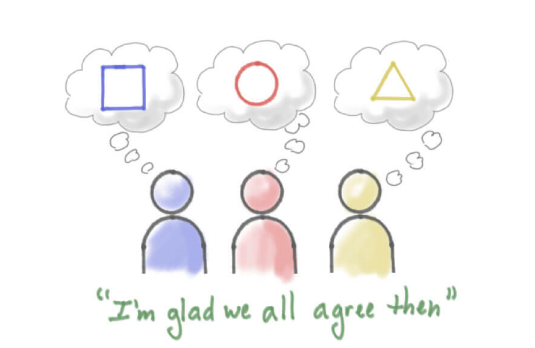

# 极说・拯救你的加班，极客效率七问

作者：IC 极客交流群

<!--Music: 大王叫我来巡山 -->

## 关于我们 ：

> 1. IC 极客之家由 IC 行业的几位工程师发起，以公益，开源，分享为宗旨，致力于推广 IC 极客文化，组织大家深入交流 IC 设计领域知识，经验及方法学，打造 IC 设计圈的思想国。
> 2. 极刊，极说，极问文章请关注公众号 icgeeks. 极刊为独立撰稿人关于 IC 设计的技术分享，极说与极问基于讨论交流信息整理，内容由技术委员会确认发布。
> 3. 欢迎文末留言参与讨论，入群，群内服务及合作请联系微信号 sgsphoto

老大叫我来加班，我到公司转一转，调出我的波形敲起我的代码，干活充满节奏感... 吗？跟加班常常一起出现的词叫做效率，包括个人效率和团队效率，拿什么拯救你的加班，我们准备了七个问题，听听 IC 极客怎么说？ 

---

## &#9758; 你一天的工作时间是如何分配的？

A1：上午处理杂事，列出今日 TODO，正式工作从下午开始，进入免打扰模式，写代码，读文档，晚上看书，写文章，沟通。我是咖啡重度依赖患者，下午效率高，晚上灵感多。

A2: 上午回复邮件，处理杂事，饭后休息，午后集中 2-3 个小时做今天最重要的事儿。剩下时间闲聊，咨询，寻求合作。

A3: 6 点起床，健身房一小时。7 点 30 开始工作，10 点前无人打扰，下午 4 点后搞下文档， 交付，7 点走人

A4: 七点起床，锻炼，阅读，早饭；九点前进公司：看邮件，处理日常事务；做自己的项目，处理技术问题；下午：基本技术工作，时有杂事插入；晚上：看个 job，补补自己的短板。八点左右下班回家，练瑜伽，半小时游戏防止老年痴呆，十点半上床睡觉。

## &#9758; 分享一下提升个人工作效率的方法

A1: 找间会议室，戴上耳机，关上门。思路不要被打断，要想效率高 需要有个整段的时间做一件事。一些小技巧，Email 很多的，可以集中一天三个时间段 check， 避免耗在里面。 

A2: 说到效率，首先要做减法。断舍离嘛。能推掉的都说 no，能让别人做的就让别人做，能用工具做的让工具做。懒惰是一个工程师最重要的优秀品质。比如写 verilog 吧，能用公司库文件的别自己写，尽量参数化提高重用性，语法简洁，弄个好的编辑器，写点好的脚本自动生成。这些属于小技巧。最主要的还是懒惰。

## &#9758; 如何提高开会效率，部门会，项目会，小组会，临时突发事情的紧急会

A1：需要多人参加的会，原则一，能不开的会尽量少开，开会非常消耗时间，而且把别人一整块的时间切断，很罪恶。原则二，轻量级沟通，微信群或邮件用的好的话完全可以替代开会。原则三，例会多用电子看板，少用 ppt，能用一张图表达让别人 3 分钟看懂的不要哔哔 10 分钟。

A2: 想要提高开会效率，必须有一个高效率的领导，或者组织者。会前整理好 items，会中记录结论，会后发布 action

A3：参与者自己的时间观念。开会前半小时我们等 bob 上线，开会中 bob 要去接孩子，开会快结束了 bob 掉线了

A4：一次开会是用来解决某一问题，不是用来提问 / 更新进度的。开会时避免人太多，人越多越没效率 hold meeting 的人需要控制进度

A5: 开会要有效率
1) 首先是 agenda 清晰, 参与的人先做好 homework. 会上讨论的文档预先发给参加的人会有很大帮助.
2) 会议上不要展开讨论问题, 只通报同步 status, 明确 issue, 分配资源, 和做决断. 所有的问题细节讨论, 都应该在会下, 小范围面对面进行. 会上只提交结论, 或资源需求.
3) 对每个议题设定一个时间长度, 超过而做不出决断, 就记录下来, 会后再把相关人聚在一起协商.
4) 要有清晰简明的会议记录, 要有人会后追踪进度.
会议越小, 越有效率. 开会消耗的人力资源是所有与会人员 * 会议时间.
陪绑是一件很痛苦的事. 特别是你有自己的工作要忙, 还得给面子坐在会议室里.. 于是会看到很多人带 Notebook 到会议室, 干着活, 不知觉地露出 "啊哈, 搞定了!" 的笑容.

A6：分工明确对提高效率非常重要，我们很少开会，因为知道自己的角色与任务，问题止于自己！

A7： 会前准备好 PPT 等资料发给参会人员查阅；会中针对重点疑问讨论、做好会议记录；会后及时跟进问题、及时反馈

## &#9758; 如何提高沟通效率，基于你的经历分享一个有用的 tips

A1： 举个反例吧，我不是一个沟通效率高的人，特别是在从 0 到 1 开发一套 flow 或者产品的时候，面向所有团队成员的沟通。原因之一，做开发本来就带有很大的创造性成分，每个人都会有自己的想法和喜好，原因二，对结果太过苛求，给别人形成一种必须按照我的想法做事而不是按照自己想法做事的感受，使得对方的意愿和效率都大打折扣，原因三，个人能量密度不够，对他人的影响力不够，常常觉得有费力沟通的时间我自己都做完了，于是总忍不住撸起袖子自己上。所以就导致一个恶性循环，越不沟通沟通效率越低。求支招~~~

A2: 提高沟通效率，我觉得需要加快 feedback 的速度，有些流程需要更改。例如：前端小模块就要进行 DC 综合 + 验证，提前发现问题，别扔到后端流程里再翻回来改。

A3： SMART 原则 目标管理

- Specific 具体的；
- Measurable 可测量的；
- Attainable 可达到的；
- Relevant 相关的；
- Time based 时间的；

意义：人们在制定工作目标或者任务目标时，考虑一下目标与计划是不是 SMART 化的。只有具备 SMART 化的计划才是具有良好可实施性的，也才能指导保证计划得以实现。

## &#9758; 你认为团队效率的大杀手是什么，举三个例子

A1：没有共享目标，共享目标是需要做到团队每个成员都能清晰且基本一致的说出我们的短中长期目标是什么 2- 开会 3- 协作流程不够优化

A2: 团队效率杀手 我觉得排名第一是开会。第二是没文档，啥都考嘴说，说了就忘

A3：文档的泛滥也是个大问题

A4：我只有一个，沟通

A5：同一件事有多个负责人；任务分配没有明确的完成标准以及时间点

## &#9758; 完成一件复杂的事情需要如何做任务切分，举个例子

A1：参考马斯克是如何计划火星移民的

A2: 切分复杂的项目，是个手艺活儿，没有一定之规。对操刀之人要有很高的要求，首先要确保手起刀落利落干净，切的要细要合适，搭配罚则配合实施，其次要有菩萨心肠，复杂的事情必有复杂的情节在其中起不可估量的影响。知人善用无时无刻不在考验主刀人的境界。

## &#9758; 关于 linux 工作环境，工具，eda 工具，流程，举个你非常喜欢的能够提升效率的用法的场景

A1：关于控制寄存器的 flow，是前端常用的。从寄存器定义开始，生成 rtl 代码，生成验证需要的代码比如 ral，生成软件需要的头文件，生成调试需要的程序，生成 FPGA 脚本，生成 emulator 脚本，生成产品说明书。大的公司有专门 flow，开源的也有一些，但是推广不是很好。

A2：推荐大家使用 tmux 来管理自己的 termianl 和 shell，让自己的环境和自己的操作更加的融合。

A3：Vim 如果学会了写插件，可以省略写很多小脚本的工作，很多文本处理直接用 Vim 就可以了，有时候不需要去写脚本处理，如果要复用，存成函数，以后每次打开 Vim 然后调用 Vim 的命令就好了。

