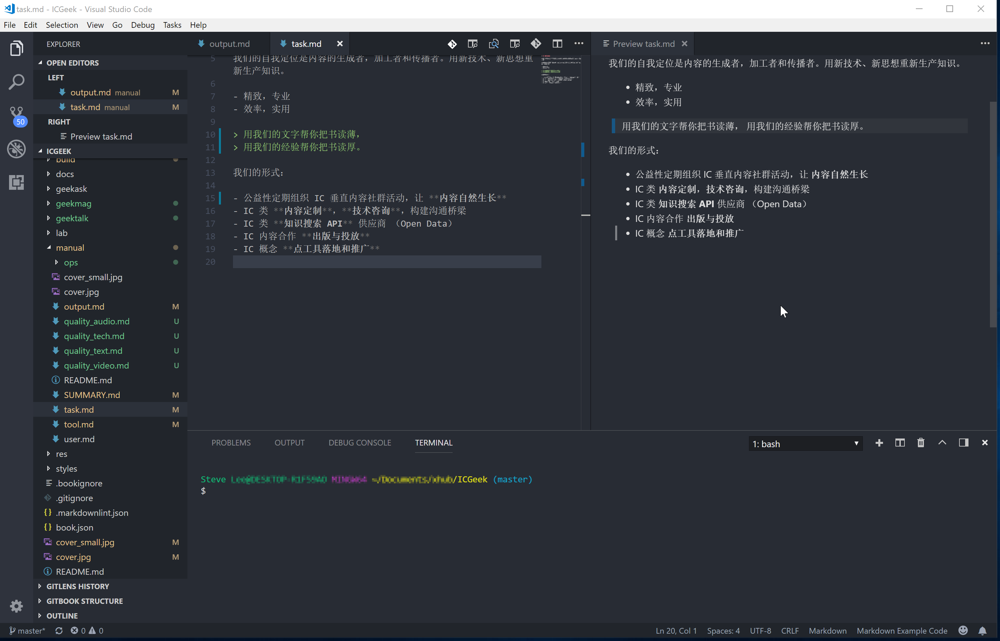

# IC 极客内容生产工具链

文章以 Markdown 为主力格式，所有入库的文章必须以 Markdown 格式入库。

存储格式为 Markdown，如果嘉宾不会使用 markdown，需要一些协助。

## VSC

下载 [Visual Studio Code](https://code.visualstudio.com/)。

插件配备

- Markdown All in One
- markdownlint
- Markdown Preview Enhanced
- Python
- Gitbook kit
- Perl Debug
- Tcl
- pangu

## Gitbook

需要先安装 nodejs，然后安装 gitbook 包。

安装方法稍后更新

## Calibre

下载安装 [Calibre](https://calibre-ebook.com/)

gitbook 需要 calibre 的转 PDF 功能。

## Git

git Window 客户端

## GIMP

图像编辑软件

- 下载安装： [GIMP](https://www.gimp.org/)
- 统一版本：2.10.2

## Dia

流程制作工具

下载安装 [Dia](http://dia-installer.de/)

## 在线资源

- https://unsplash.com/
- https://www.freeimages.com/
- https://www.dafont.com/
- http://www.fonts.net.cn
- http://1024tools.com/
- http://www.58pic.com

## 内容模板建设

内部使用 (Internal Only)
